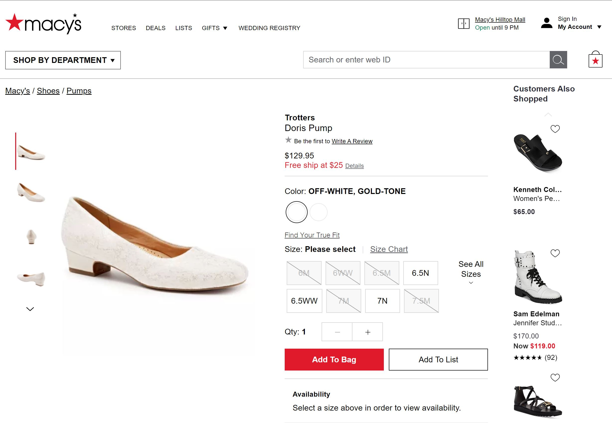
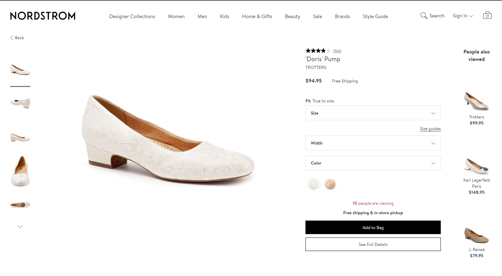

# 👚 Webscraper for Price Comparison

Project was motivated by a student project at [Forkaia incubator](https://www.forkaia.com/) building a shopping assistant application for professional women. The algorithm automatizes web scraping process from three online stores: [Nordstrom](https://shop.nordstrom.com/), [Macy's](https://www.macys.com/) and [Neiman Marcus](https://www.neimanmarcus.com/), and generates a csv file containing the list of all overlapping items and their prices.

## 🕸️ Webscraping

[Beatiful Soup HTML parser](https://www.crummy.com/software/BeautifulSoup/bs4/doc/) and [Selenium webdriver](https://selenium.dev/) were used alongside Python for webscraping process. Within the scripts folder are the actual Python scripts. The scripts share three methods: `fetch_url`, `fetch_page`, and `fetch_all`.

1. The `fetch_url` method returns the http address of an item category's first shopping page. The only parameter is the item category represented by pre-defined strings. There are a total of five categories currently available:
    * women's shoes
    * women's clothing
    * men's shoes
    * men's clothing
    * handbags
2. The `fetch_page` takes in the http address of a single shopping page and a dataframe. The method fills the dataframe with information of listed items such as item name, price and link.
3. The `fetch_all` methods also takes in the https address of a shopping page and a dataframe. The method automatically moves on to next page and calls `fetch_page` method until it reaches the very end.

Calling `fetch_page` for each file generates a corresponding .csv file in the data folder which contains all scraped data.

## 📋 Table Generator

`table_generator.py` has a `compare_price` method that takes in one of the five item categories listed above and generates `output.csv` in the root directory containing a list of all overlapping items with their prices and store links (note that the item names will have been processed for ease of comparison). The current version lists all items in the women's shoes category as of January 2nd, 2020.

## 👠 Results, Improvements and Other Use Scenarios

As can be seen in the images above, I was able to observe several price discrepencies in between major online stores. However, the scraping process does appear to be overly intensive for its purpose since the algorithm essentially recreates entire database tables. I have come to conclude that a more efficient price comparing algorithm would simply look up prices from other stores in real time as a shopper browses through store pages much like [honey](https://www.joinhoney.com/).

However, other use scenarios and room for improvements do come to mind.
1. The stores themselves could scrape price data from other retailers periodically and reflect the price discrepancies to prevent customer loss.
2. An incoming retailer could collect price data from other major retailers to gain an advantage in the market.
3. Data on item color and size could be collected in case the type of item a customer is looking for is missing in the current store.

🔚
